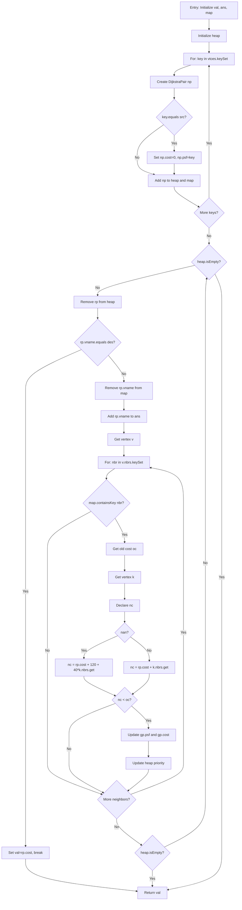

# Control Flow Graph (CFG) for dijkstra Method

## Target Function
**Method:** `dijkstra(String src, String des, boolean nan)`  
**Location:** `Graph_M.java`, lines 200-265

## Node List

| Node ID | Line(s) | Description | Type |
|---------|---------|-------------|------|
| N1 | 200-202 | Entry: Method start, initialize val, ans, map | Entry |
| N2 | 206 | Initialize heap | Statement |
| N3 | 208 | For loop initialization (key : vtces.keySet()) | Loop Entry |
| N4 | 210-213 | Create DijkstraPair np, set vname and cost | Statement |
| N5 | 215 | If condition: key.equals(src) | Decision |
| N6 | 217-218 | Set np.cost = 0, np.psf = key | Statement |
| N7 | 221-222 | Add np to heap and map | Statement |
| N8 | 223 | End of for loop (implicit) | Loop Exit |
| N9 | 226 | While loop condition: !heap.isEmpty() | Loop Entry |
| N10 | 228 | Remove pair from heap: rp = heap.remove() | Statement |
| N11 | 230 | If condition: rp.vname.equals(des) | Decision |
| N12 | 232-233 | Set val = rp.cost, break | Statement |
| N13 | 236 | Remove rp.vname from map | Statement |
| N14 | 238 | Add rp.vname to ans | Statement |
| N15 | 240 | Get vertex: v = vtces.get(rp.vname) | Statement |
| N16 | 241 | For loop initialization (nbr : v.nbrs.keySet()) | Loop Entry |
| N17 | 243 | If condition: map.containsKey(nbr) | Decision |
| N18 | 245 | Get old cost: oc = map.get(nbr).cost | Statement |
| N19 | 246 | Get vertex: k = vtces.get(rp.vname) | Statement |
| N20 | 247 | Declare nc | Statement |
| N21 | 248 | If condition: nan | Decision |
| N22 | 249 | Calculate nc with time formula | Statement |
| N23 | 251 | Calculate nc with distance formula | Statement |
| N24 | 253 | If condition: nc < oc | Decision |
| N25 | 255-257 | Update gp.psf and gp.cost | Statement |
| N26 | 259 | Update heap priority | Statement |
| N27 | 262 | End of inner for loop | Loop Exit |
| N28 | 263 | End of while loop | Loop Exit |
| N29 | 264 | Return val | Exit |

## Edge List

| Edge ID | From Node | To Node | Condition/Type |
|---------|-----------|---------|-----------------|
| E1 | N1 | N2 | Sequential |
| E2 | N2 | N3 | Sequential |
| E3 | N3 | N4 | Loop body entry |
| E4 | N4 | N5 | Sequential |
| E5 | N5 | N6 | True branch (key.equals(src)) |
| E6 | N5 | N7 | False branch (key != src) |
| E7 | N6 | N7 | Sequential |
| E8 | N7 | N8 | Sequential |
| E9 | N8 | N3 | Loop back (more keys) |
| E10 | N8 | N9 | Loop exit (no more keys) |
| E11 | N9 | N10 | Loop body entry |
| E12 | N10 | N11 | Sequential |
| E13 | N11 | N12 | True branch (rp.vname.equals(des)) |
| E14 | N11 | N13 | False branch (rp.vname != des) |
| E15 | N12 | N29 | Break (exit loop) |
| E16 | N13 | N14 | Sequential |
| E17 | N14 | N15 | Sequential |
| E18 | N15 | N16 | Sequential |
| E19 | N16 | N17 | Loop body entry |
| E20 | N17 | N18 | True branch (map.containsKey(nbr)) |
| E21 | N17 | N27 | False branch (nbr not in map) |
| E22 | N18 | N19 | Sequential |
| E23 | N19 | N20 | Sequential |
| E24 | N20 | N21 | Sequential |
| E25 | N21 | N22 | True branch (nan == true) |
| E26 | N21 | N23 | False branch (nan == false) |
| E27 | N22 | N24 | Sequential |
| E28 | N23 | N24 | Sequential |
| E29 | N24 | N25 | True branch (nc < oc) |
| E30 | N24 | N27 | False branch (nc >= oc) |
| E31 | N25 | N26 | Sequential |
| E32 | N26 | N27 | Sequential |
| E33 | N27 | N16 | Loop back (more neighbors) |
| E34 | N27 | N28 | Loop exit (no more neighbors) |
| E35 | N28 | N9 | Loop back (heap not empty) |
| E36 | N28 | N29 | Loop exit (heap empty) |

## CFG Diagram (Mermaid)

## Control Flow Summary

- **Entry Node:** N1 (line 200)
- **Exit Node:** N29 (line 264)
- **Decision Nodes:** N5 (line 215), N11 (line 230), N17 (line 243), N21 (line 248), N24 (line 253)
- **Loop Nodes:** 
  - N3-N8: For loop iterating over vertices (lines 208-223)
  - N9-N28: While loop processing heap (lines 226-263)
  - N16-N27: Nested for loop iterating over neighbors (lines 241-262)
- **Total Nodes:** 29
- **Total Edges:** 36

